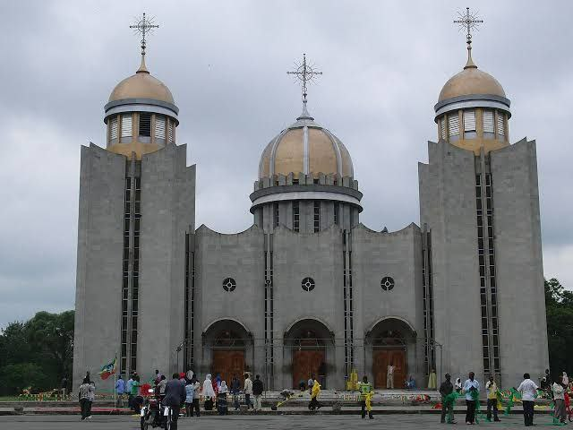
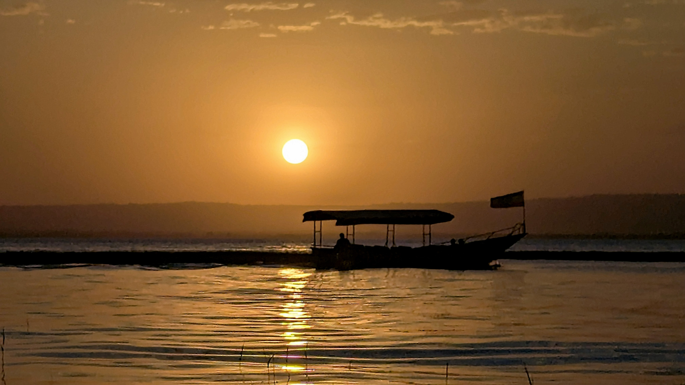
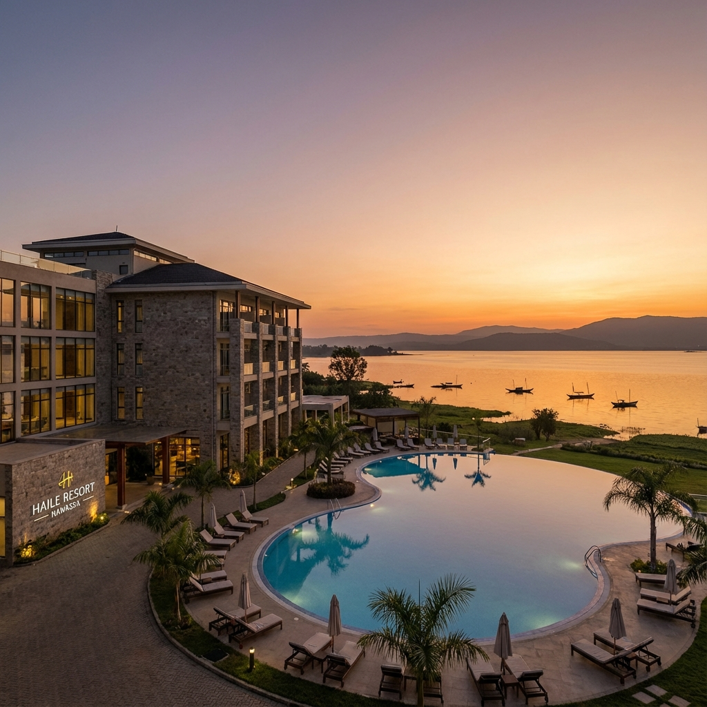
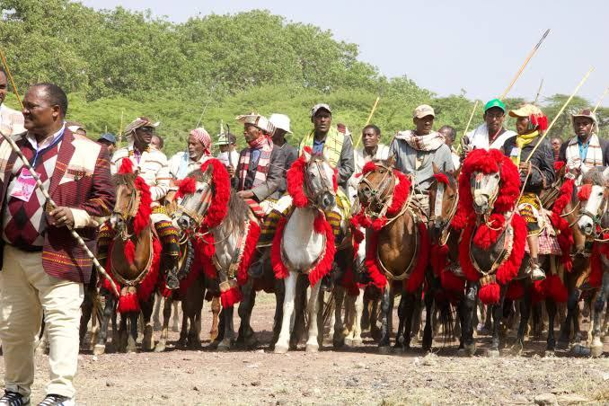

# Visit Hawassa

A comprehensive tourism website showcasing the beauty, culture, and attractions of Hawassa City, Ethiopia.

## About This Project

Visit Hawassa is a static website designed to promote tourism in Hawassa City. The site features detailed information about religious sites, entertainment venues, resorts, local cuisine, and travel tips for visitors planning to explore this beautiful lakeside city.


## Project Structure

```
Visit-Hawassa/
├── css/
│   └── style.css          # Main stylesheet
├── images/                # All image assets
├── index.html             # Home page
├── about.html             # About Hawassa
├── religious.html         # Religious sites
├── entertainment.html     # Entertainment venues
├── resorts.html          # Hotels and resorts
├── food.html             # Local cuisine
├── gallery.html          # Photo gallery
├── travel.html           # Travel tips
├── contact.html          # Contact form (EmailJS integration)
└── main.js               # JavaScript utilities
```

## Features

### Home Page
The landing page welcomes visitors with stunning imagery and highlights the top attractions in Hawassa, including Lake Hawassa, Amora Gedel Park, the Fish Market, and Tabor Mountain.

### Religious Sites
Explore the spiritual heritage of Hawassa with detailed information about churches, monasteries, cathedrals, and mosques throughout the city.



### Entertainment and Activities
Discover recreational activities available in Hawassa, from boat rides on Lake Hawassa to parks, sports facilities, game zones, and cultural venues.



### Resorts and Accommodations
Browse through premium resorts and hotels in Hawassa, including Haile Resort, Lewi Resort, and various international hotels with modern amenities.



### Local Cuisine
Learn about traditional Ethiopian food and dining options available in Hawassa, featuring the famous fish dishes and international cuisine.

### Photo Gallery
View a curated collection of nature and cultural photographs showcasing the scenic beauty and vibrant culture of Hawassa.



### Travel Tips
Practical information for visitors including transportation options, best times to visit, local customs, and essential travel advice.

### Contact Form
Functional contact form powered by EmailJS that allows visitors to send inquiries directly to the tourism office.

## Technologies Used

- **HTML5** - Semantic markup for page structure
- **CSS3** - Modern styling with custom properties and responsive design
- **JavaScript** - Interactive features and form handling
- **EmailJS** - Email service for contact form functionality

## Design Features

- Responsive layout that works on desktop and mobile devices
- Modern navigation with dropdown menus
- Zig-zag layout for alternating content sections
- Card-based design for showcasing attractions
- Masonry grid layout for photo gallery
- Smooth transitions and hover effects
- Clean, organized folder structure

## Setup and Installation

### Basic Setup

1. Clone or download the repository
2. Open `index.html` in a web browser
3. Navigate through the pages using the navigation menu

### Contact Form Configuration

The contact form requires EmailJS setup:

1. Create a free account at [emailjs.com](https://www.emailjs.com/)
2. Add your email service and create a template
3. Update the credentials in `contact.html`:
   - Replace `YOUR_PUBLIC_KEY` with your EmailJS public key
   - Replace `YOUR_SERVICE_ID` with your service ID
   - Replace `YOUR_TEMPLATE_ID` with your template ID

## Pages Overview

### index.html
The main landing page featuring hero sections and top attractions with eye-catching imagery and descriptions.

### about.html
Comprehensive information about Hawassa City, its history, demographics, and significance.

### religious.html
Detailed showcase of religious sites including:
- St. Gabriel Monastery
- Holy Trinity Cathedral
- Medhanialem Church
- Kidane Mehret Cathedral
- Central Mosque
- Kale Heywet Church
- Full Gospel Church

### entertainment.html
Entertainment and recreational activities:
- Lake Hawassa boat rides
- Amora Gedel Park
- Lakeside walking areas
- Cinema and cultural venues
- Sports facilities
- Game zones
- Coffee shops
- Beauty and spa services
- Shopping centers

### resorts.html
Premium accommodations:
- Haile Resort Hawassa
- Lewi Resort
- Kerawud International Hotel
- Central Hawassa Hotel

### food.html
Culinary experiences featuring traditional Ethiopian cuisine and international dining options.

### gallery.html
Photo collections organized by categories:
- Nature photography
- Cultural imagery

### travel.html
Essential visitor information and travel tips for planning a trip to Hawassa.

### contact.html
Interactive contact form for visitor inquiries and feedback.

## Image Assets

All images are organized in the `images/` directory and include:
- High-quality photographs of Lake Hawassa
- Religious site imagery
- Resort and hotel photos
- Entertainment venue pictures
- Cultural and nature photography
- Attraction highlights

## Browser Compatibility

The website is compatible with modern web browsers including:
- Google Chrome
- Mozilla Firefox
- Microsoft Edge
- Safari
- Opera

## License

This project is created for educational and promotional purposes for Hawassa City tourism.

## Contact

For inquiries about the website or Hawassa tourism:
- Email: swale4126@gmail.com
- Phone: +251 963 621 997

---

**Visit Hawassa** - Discover the beauty of Ethiopia's lakeside gem.
